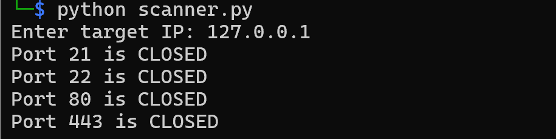

# 🔐 Network Scanner

## 📌 Description
A Python-based network scanner that detects open ports on a target system. This project helped me understand networking concepts, socket programming, and basic penetration testing techniques.

## ⚙️ Features
- Scan common ports (21, 22, 80, 443)
- Fast socket-based scanning
- Beginner-friendly implementation

## 🛠️ Tech Stack
- Python
- Socket Programming

## ▶️ How to Run
```bash
python scanner.py

## 📸 Sample Output

